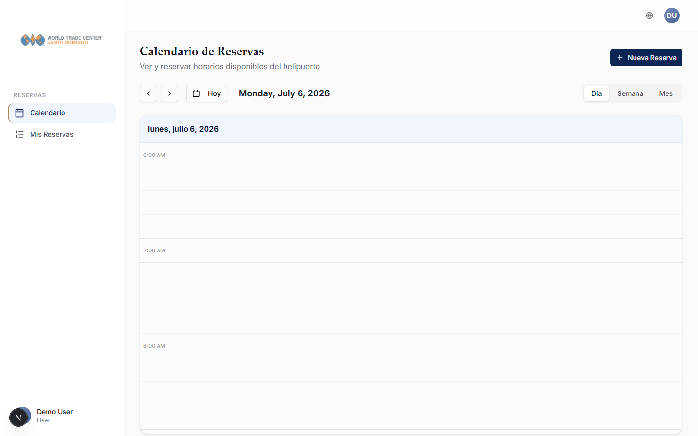
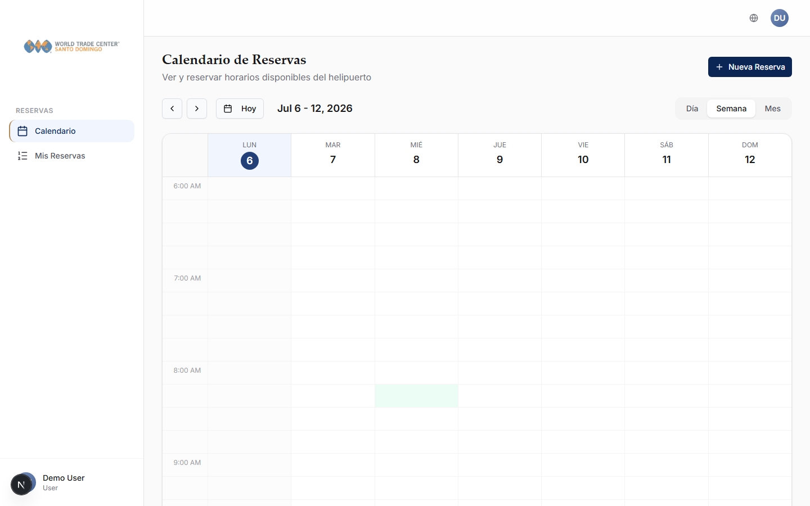
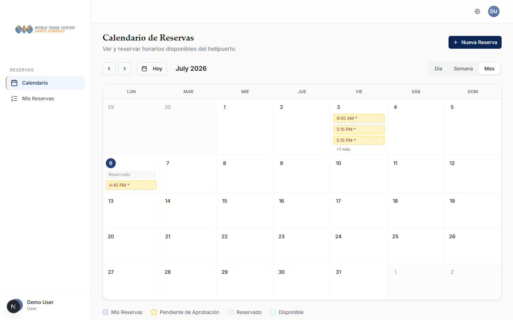
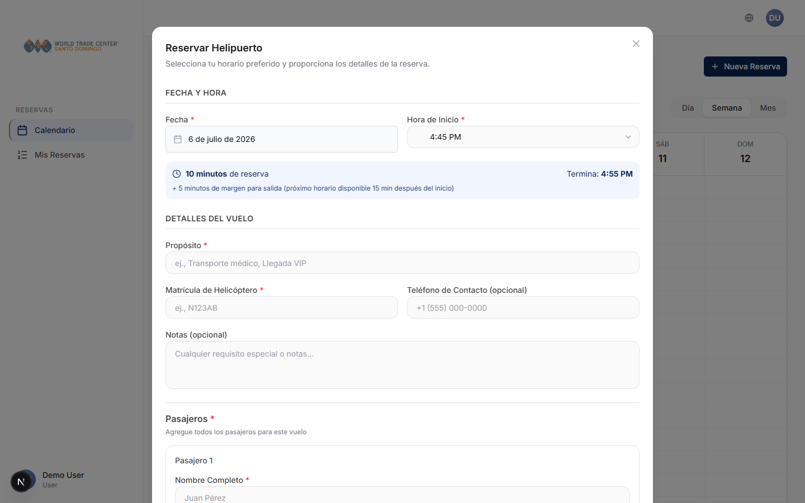
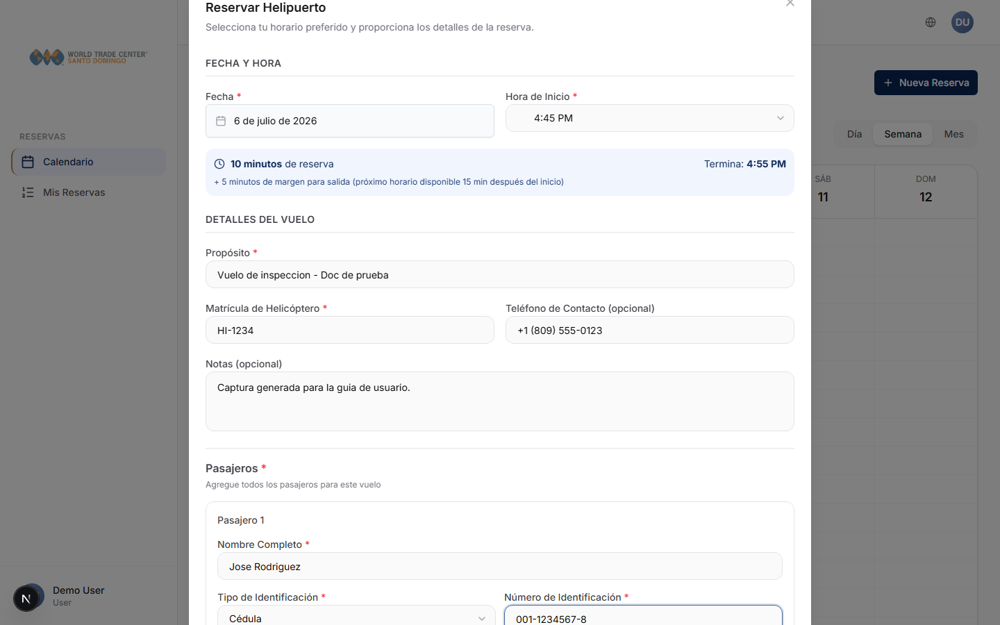
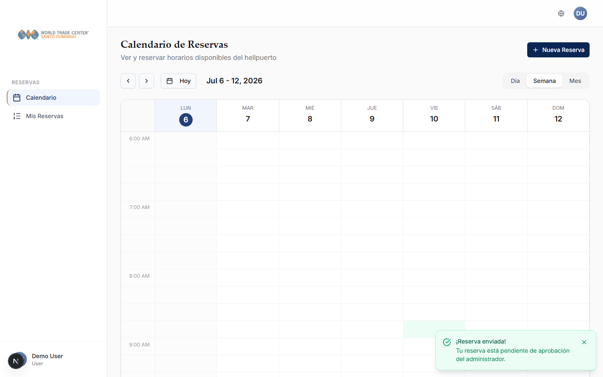
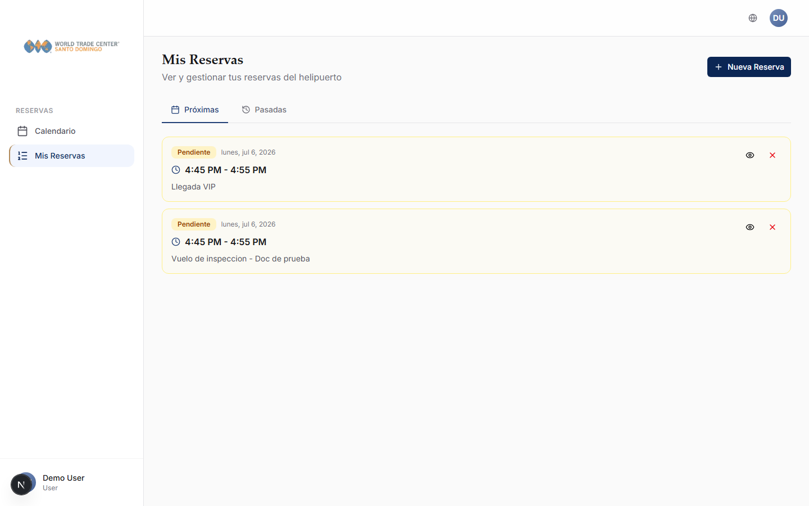
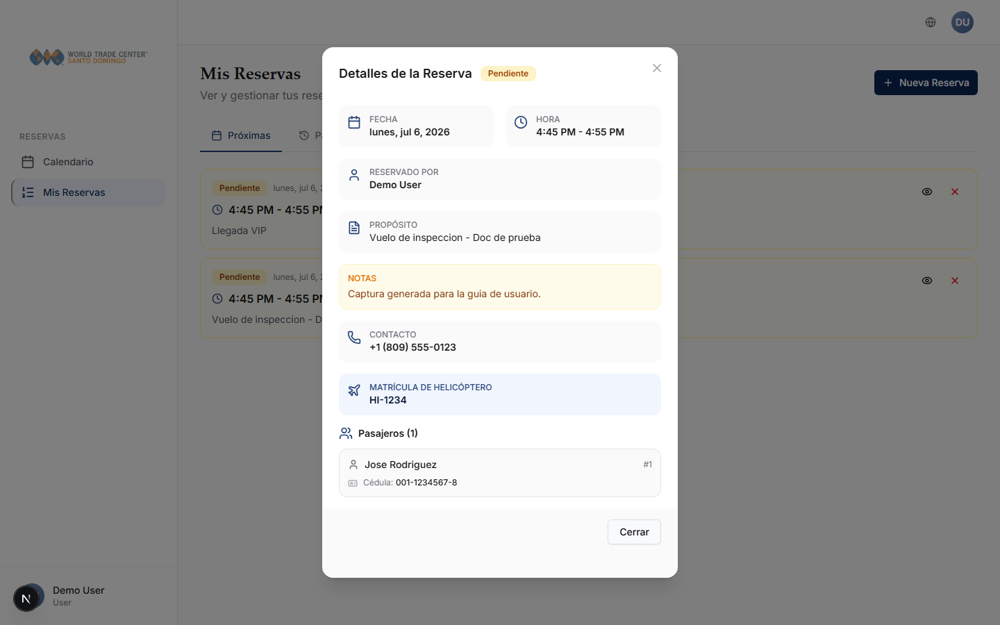
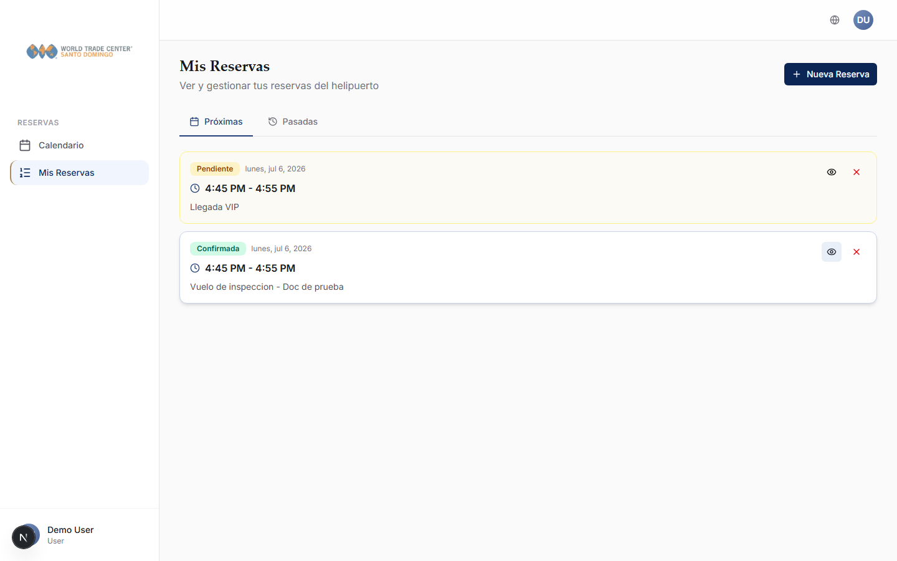
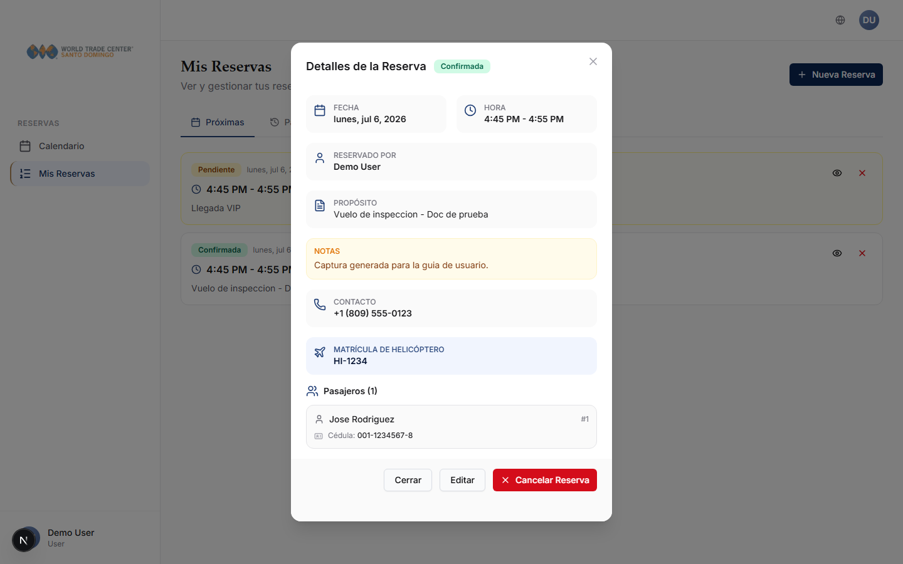

# Guia de usuario final - Helipad Booking

Esta guia explica como usar la aplicacion paso a paso. Las capturas de pantalla estan en [`docs/screenshots/`](./docs/screenshots/).

## 1. Entrar a la aplicacion

1. Abre la pagina de la aplicacion.
2. Escribe tu usuario.
3. Escribe tu contrasena.
4. Haz clic en **Iniciar sesion**.

Si olvidaste tu contrasena:

1. Haz clic en **Olvide mi contrasena**.
2. Escribe tu correo.
3. Revisa tu correo.
4. Abre el enlace recibido.
5. Crea una nueva contrasena.

## 2. Ver el calendario

1. En el menu, entra a **Calendario**.
2. Puedes ver las reservas por:
   - Dia.
   - Semana.
   - Mes.
3. Usa los botones de anterior y siguiente para cambiar de fecha.
4. Usa **Hoy** para volver al dia actual.

| Dia | Semana | Mes |
| --- | --- | --- |
|  |  |  |

Colores del calendario:

- Reserva propia: tus reservas.
- Pendiente: reserva esperando aprobacion.
- Otra reserva: reserva de otro usuario.
- Disponible: horario libre.

## 3. Crear una reserva

1. Entra a **Calendario**.
2. Haz clic en **Nueva reserva**.
3. Selecciona la fecha.
4. Selecciona la hora de inicio.
5. Escribe el motivo de la reserva.
6. Escribe la matricula del helicoptero.
7. Escribe un telefono de contacto si aplica.
8. Escribe notas adicionales si aplica.

## 4. Agregar pasajeros

1. En el formulario de reserva, baja hasta **Pasajeros**.
2. Escribe el nombre del pasajero.
3. Selecciona el tipo de identificacion:
   - Cedula.
   - Pasaporte.
   - Otro.
4. Escribe el numero de identificacion.
5. Si tienes foto o documento, subelo en el campo indicado.
6. Para agregar otro pasajero, haz clic en **Agregar pasajero**.
7. Repite los pasos para cada pasajero.

Cuando termines:

1. Revisa la informacion.
2. Haz clic en **Reservar ahora**.

## 5. Saber si la reserva fue aprobada

Despues de crear una reserva:

- Si eres usuario normal, la reserva queda **Pendiente**.
- Un administrador debe aprobarla.
- Cuando se aprueba, cambia a **Confirmada**.
- Si se rechaza o cancela, cambia a **Cancelada**.

Tambien puedes recibir una notificacion por correo si el sistema de correos esta configurado.

## 6. Ver mis reservas

1. En el menu, entra a **Mis reservas**.
2. Veras tus reservas proximas.
3. Para ver reservas anteriores, entra en la pestana **Pasadas**.
4. Haz clic en el icono del ojo de una reserva para ver sus detalles.

Una vez que el administrador aprueba la solicitud, el estado cambia a **Confirmada**:

## 7. Editar una reserva

1. Entra a **Mis reservas**.
2. Abre la reserva.
3. Haz clic en **Editar** si el boton esta disponible.
4. Cambia la informacion necesaria.
5. Revisa pasajeros y datos del vuelo.
6. Haz clic en **Actualizar reserva**.

Nota: solo las reservas **confirmadas** muestran los botones de Editar y Cancelar; las pendientes o pasadas no se pueden modificar desde aqui.

## 8. Cancelar una reserva

1. Entra a **Mis reservas**.
2. Busca la reserva confirmada.
3. Abre el detalle y haz clic en **Cancelar Reserva**.

La reserva quedara como **Cancelada**.

## 9. Para administradores: ver el panel

1. Entra a **Dashboard**.
2. Revisa:
   - Reservas de hoy.
   - Reservas de la semana.
   - Reservas del mes.
   - Reservas proximas.
   - Usuarios activos.
   - Horarios mas usados.

## 10. Para administradores: aprobar o rechazar reservas

1. Entra a **Reservas** o **Todas las reservas**.
2. Busca una reserva con estado **Pendiente**.
3. Haz clic en el icono de ver detalles si quieres revisar la informacion.
4. Revisa:
   - Fecha.
   - Hora.
   - Usuario.
   - Matricula.
   - Pasajeros.
   - Documento o foto si fue cargado.
5. Para aprobar, haz clic en **Aprobar**.
6. Para rechazar, haz clic en **Rechazar**.

## 11. Para administradores: cancelar una reserva confirmada

1. Entra a **Todas las reservas**.
2. Busca la reserva.
3. Abre los detalles.
4. Haz clic en **Cancelar**.

## 12. Para administradores: filtrar reservas

1. Entra a **Todas las reservas**.
2. Usa los filtros:
   - Fecha desde.
   - Fecha hasta.
   - Estado.
3. Haz clic en limpiar si quieres quitar filtros.

## 13. Para administradores: exportar reservas

1. Entra a **Todas las reservas**.
2. Aplica filtros si los necesitas.
3. Haz clic en **Exportar CSV**.
4. Se descargara un archivo con las reservas visibles.

## 14. Para administradores: crear usuarios

1. Entra a **Usuarios**.
2. Haz clic en **Nuevo usuario**.
3. Completa:
   - Usuario.
   - Correo.
   - Nombre.
   - Apellido.
   - Rol.
   - Contrasena.
4. Guarda el usuario.

Roles disponibles:

- **Usuario**: puede crear y ver sus reservas.
- **Seguridad**: puede consultar reservas y datos para operacion.
- **Administrador**: puede gestionar todo.

## 15. Para administradores: activar o desactivar usuarios

1. Entra a **Usuarios**.
2. Busca el usuario.
3. Abre sus opciones o edicion.
4. Cambia el estado a activo o inactivo.
5. Guarda.

Un usuario inactivo no debe poder entrar al sistema.

## 16. Para administradores: cambiar configuracion general

1. Entra a **Configuracion**.
2. Ajusta el horario operativo.
3. Ajusta la duracion de bloques.
4. Ajusta el aviso minimo para reservar.
5. Ajusta la duracion maxima.
6. Haz clic en **Guardar cambios**.

## 17. Para administradores: bloquear fechas

1. Entra a **Configuracion**.
2. Busca la seccion de fechas bloqueadas.
3. Selecciona una fecha.
4. Haz clic en **Agregar fecha**.

Para quitar una fecha bloqueada:

1. Busca la fecha en la lista.
2. Haz clic en la **X**.

## 18. Para administradores: configurar correos

1. Entra a **Email**.
2. Selecciona el proveedor disponible.
3. Completa los datos solicitados.
4. Guarda la configuracion.
5. Usa la opcion de prueba si esta disponible.

## 19. Para seguridad

1. Entra con tu usuario de seguridad.
2. Abre **Todas las reservas**.
3. Filtra por la fecha de hoy si lo necesitas.
4. Abre una reserva para ver:
   - Usuario.
   - Fecha y hora.
   - Matricula.
   - Pasajeros.
   - Documento cargado.
5. Usa esa informacion para validar la operacion.

El rol de seguridad es principalmente de consulta.

## 20. Recomendaciones de uso diario

1. Revisa las reservas pendientes al inicio del dia.
2. Aprueba solo cuando la informacion este completa.
3. Verifica matricula y pasajeros antes de la operacion.
4. Cancela o rechaza reservas que no tengan datos suficientes.
5. Usa filtros para encontrar reservas rapidamente.
6. Mantén actualizados los usuarios activos.
7. Revisa que el correo este funcionando si dependen de notificaciones.

## 21. Problemas comunes

No puedo entrar:

1. Revisa usuario y contrasena.
2. Pide a un administrador que confirme que tu usuario esta activo.
3. Usa recuperar contrasena si aplica.

No puedo reservar:

1. Revisa que la fecha no sea pasada.
2. Revisa que el horario este disponible.
3. Agrega al menos un pasajero.
4. Completa la matricula del helicoptero.

Mi reserva aparece pendiente:

1. Espera la aprobacion del administrador.
2. Revisa despues en **Mis reservas**.

No llego el correo:

1. Revisa spam o correo no deseado.
2. Pide al administrador revisar la configuracion de email.
